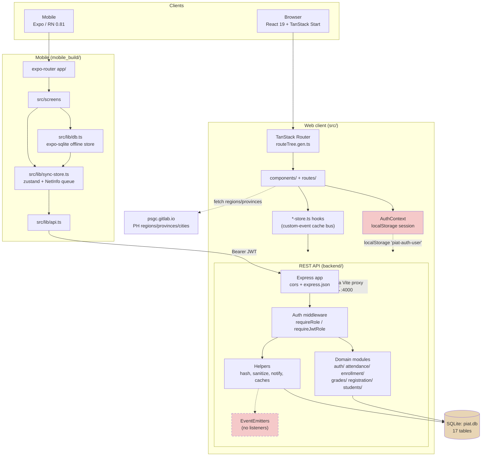
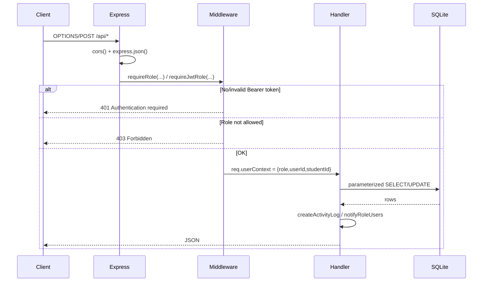
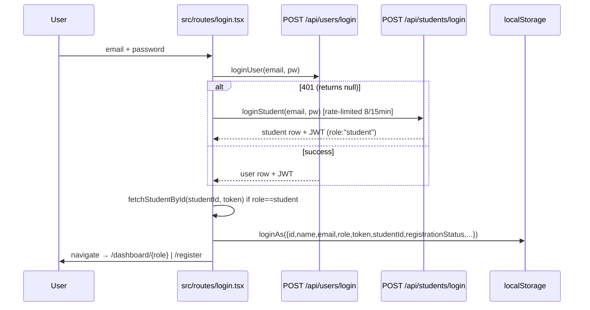
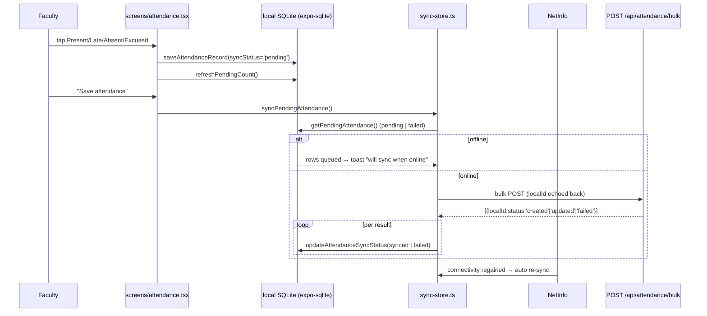

# PIAT Academic Management System — Codebase Scan Report

**Scan date:** 2026-10-01
**Repository root:** `C:\capstone2-main`
**Branch:** `main` (HEAD `50176c2 "up"`)
**Working tree:** `backend/index.js` modified (uncommitted); `.kilo/` untracked
**Scope:** all source under `src/`, `backend/`, `mobile_build/`, plus root config.
**Excluded from analysis:** `node_modules/` (root, backend, mobile_build), `.git/`, `dist/`, `.expo/`, `.wrangler/`, `.idea/`, `.venv/`, `*.lock`, `*.exe`, `*.msi`, image assets.
**No `.kilocodeignore` exists**; `.gitignore` was honoured. Note that `.gitignore` does **not** ignore `backend/piat.db`, `backend/*.db`, `*.exe`, `*.msi` — see Risk R-13.

---

## 1. Repository overview

PIAT is a **three-tier academic management system** for "Philtech Institute Of Arts And Technology":

| Tier | Directory | Purpose |
|---|---|---|
| Web client | `src/` | React 19 SPA + TanStack Start/React Router, role-based dashboards (student, faculty, registrar, admin) |
| REST API | `backend/` | Node.js + Express 4 + SQLite (`sqlite3`), JWT auth, ~74 endpoints |
| Mobile client | `mobile_build/` | Expo 54 / React Native 0.81 app, offline-first attendance with local SQLite + sync queue |

The three tiers are separate `package.json` trees and are installed/started independently. The root `package.json` acts as an orchestrator with delegating scripts.

**Codebase size (excluding lockfiles/binaries):**

| Area | Files | Approx. lines |
|---|---:|---:|
| `src/` (web) | 122 | ~19,600 |
| `backend/` (API, excl. `node_modules`) | 9 | ~4,900 |
| `mobile_build/` (mobile, excl. `node_modules`, `.expo`) | 25 | ~1,700 |
| **Total source** | **156** | **~26,200** |

Generated artifacts: `src/routeTree.gen.ts` (993 lines, TanStack Router codegen).

**Largest / most complex files:**

| File | Lines | Concern |
|---|---:|---|
| `backend/index.js` | 2,891 | Entire API: helpers, auth, all 74 routes, startup |
| `backend/db.js` | 926 | Schema DDL, indexes, migrations, seed data |
| `src/routeTree.gen.ts` | 993 | *Generated* |
| `src/lib/api.ts` | 984 | Entire typed HTTP client |
| `src/components/landing/LandingPage.tsx` | 891 | Marketing page |
| `src/routes/register.tsx` | 750 | Multi-section registration form |
| `src/components/ui/sidebar.tsx` | 691 | shadcn/ui sidebar primitive |
| `src/routes/dashboard/student.index.tsx` | 1,432 | Student dashboard (largest UI file) |
| `src/routes/dashboard/faculty.grades.tsx` | 545 | Gradebook |

---

## 2. Tech stack

### Web frontend (`src/`)
- **Build:** Vite 8 (`vite.config.ts`), config wrapped by `@lovable.dev/vite-tanstack-config`
- **Framework:** TanStack Start 1.167 (`@tanstack/react-start`), TanStack Router 1.168 (file-based routing), TanStack React Query 5.83 (declared, see Risk R-11)
- **UI:** React 19.2.3, Tailwind CSS 4 + `@tailwindcss/vite`, Radix UI primitives (24 packages), shadcn/ui component set, `lucide-react`, `sonner` (toasts), `framer-motion`, `recharts`, `cmdk`, `vaul`, `vaul`/`embla-carousel`, `react-day-picker`, `input-otp`
- **Forms/validation:** `react-hook-form` + `@hookform/resolvers` + `zod` 3.24
- **PDF:** `jspdf` 2.5 (transcript/report export)
- **Types:** TypeScript 5.8, `strict: true`, path alias `@/* → ./src/*`
- **Linting:** ESLint 9 flat config + typescript-eslint + prettier plugin; Prettier 3 (printWidth 100, double quotes, trailing commas)
- **Deployment target:** Cloudflare Workers via `@cloudflare/vite-plugin` + `wrangler.jsonc`

### Backend (`backend/`)
- Node.js ESM (`"type": "module"`), no TypeScript
- **Express 4.22**, **cors**, **jsonwebtoken 9**, **sqlite3 5.1.6** — only 4 runtime deps
- No ORM; raw parameterized SQL throughout
- Password hashing: `crypto.scryptSync` + `crypto.timingSafeEqual` (`backend/index.js:383-411`)

### Mobile (`mobile_build/`)
- **Expo 54** / **React Native 0.81.5** / React 19.1, `expo-router` 6 (file-based routes)
- **expo-sqlite** 16 (offline store), **expo-secure-store** (token storage), `@react-native-community/netinfo` (connectivity)
- **zustand 4.5** (sync/toast state), TanStack React Query (provider installed)
- **react-native-paper 5.13** (UI), `react-native-svg`, `react-native-reanimated`
- Metro / Babel / webpack configs present (see Risk R-16)

### Package managers
`npm` in all three trees (each has `package-lock.json`). No pnpm/yarn workspace file; no root workspaces declared despite the root script `npm --prefix mobile_build exec`.

---

## 3. Directory tree and purpose

```
capstone2-main/
├── src/                            # Web application
│   ├── router.tsx                  # createRouter + default error component
│   ├── routeTree.gen.ts            # GENERATED route manifest (do not edit)
│   ├── styles.css                  # Tailwind v4 entry + design tokens
│   ├── routes/                     # TanStack file-based routes
│   │   ├── __root.tsx              # HTML shell, <head>, AuthProvider, Toaster
│   │   ├── index.tsx               # "/" public landing page
│   │   ├── login.tsx               # /login (all roles)
│   │   ├── register.tsx            # /register (student application form, 750 lines)
│   │   ├── dashboard.tsx           # /dashboard layout + auth guard
│   │   ├── announcements.tsx       # shared announcements view
│   │   └── dashboard/
│   │       ├── student.*           # index, enrollment, grades, schedule, attendance (5)
│   │       ├── faculty.*           # index, subjects, subject-details, classes,
│   │       │                       #   attendance, grades, performance,
│   │       │                       #   announcements, profile (9)
│   │       ├── registrar.*         # index, registrations, students, enrollment,
│   │       │                       #   reenrollment, curriculum, subjects, faculty,
│   │       │                       #   records, reports, transcripts, profile,
│   │       │                       #   announcements (12)
│   │       └── admin.*             # index, users, analytics, security, settings,
│   │                               #   announcements (6)
│   ├── lib/
│   │   ├── api.ts                  # Typed HTTP client (984 lines) — the API boundary
│   │   ├── auth-context.tsx        # React context + localStorage session
│   │   ├── *-store.ts              # API-backed hooks + custom-event cache bus
│   │   │                           #   (users, students, subjects, enrollment,
│   │   │                           #   registrations, grades, attendance,
│   │   │                           #   notifications, announcements, clearance)
│   │   ├── notification-types.ts, notification-triggers.ts, locations.ts (PSGC API)
│   │   ├── shims/use-sync-external-store-with-selector.ts
│   │   └── utils.ts
│   ├── components/
│   │   ├── AppSidebar.tsx          # Role → nav item map
│   │   ├── DashboardHeader.tsx, StatCard.tsx, NotificationsPopover.tsx
│   │   ├── landing/LandingPage.tsx # 891-line marketing page
│   │   └── ui/                     # 47 shadcn/ui primitives (generated-style, unused-ish)
│   ├── hooks/use-mobile.tsx
│   └── types/use-sync-external-store-shim.d.ts
│
├── backend/                        # Express + SQLite API
│   ├── index.js                    # App, helpers, middleware, 74 routes, startup
│   ├── db.js                       # Schema, indexes, migrations, curriculum seed
│   ├── seed-test-data.mjs          # 200-student mock dataset generator + report
│   ├── audit-test-data.mjs         # 13 integrity checks + report
│   ├── auth/identity.js            # JWT → {role, userId, studentId}
│   ├── attendance/record.js        # Attendance payload builder
│   ├── enrollment/reenrollment.js  # Year/semester progression inference
│   ├── grades/finalization.js      # Grade-finalization SQL builder
│   ├── registration/workflow.js    # Payload validation + auto-approval
│   ├── students/normalize.js       # Payload → row normalization
│   ├── piat.db                     # 24k-line SQLite DB (committed!)
│   ├── piat.db.reset-backup-20260924-225101.db
│   └── data.db                     # 0 bytes, unreferenced
│
├── mobile_build/                   # Expo app
│   ├── app/                        # expo-router screens (7)
│   │   ├── _layout.tsx             # Providers + DB init + sync bootstrap
│   │   ├── index, login, dashboard, subjects, history, profile
│   │   └── attendance/[subjectId].tsx
│   ├── src/
│   │   ├── screens/                # login, dashboard, attendance implementations
│   │   ├── components/            # MobileShell.tsx, PiatLogo.tsx
│   │   └── lib/                    # api.ts, db.ts, sync-store.ts, storage.ts,
│   │                               #   toast-store.ts, utils.ts
│   ├── app.config.js, metro/babel/webpack configs, .env, .env.example
│   ├── assets/                     # icon/splash PNGs
│   └── package.json
│
├── public/piat-logo.svg            # Only static asset
├── dist/{client,server}            # Build output (gitignored)
├── wrangler.jsonc                  # Cloudflare Workers config
├── vite.config.ts, tsconfig.json, eslint.config.js, .prettierrc, index.html
└── *.md                            # README + 4 generated test reports (committed)
```

**Note on `src/components/ui/`:** 47 files. Most are unused. The app imports only `button`, `form`, `sonner`, `sidebar` directly, plus whatever the routes pull in.

---

## 4. Entry points

| Entry point | File | Notes |
|---|---|---|
| **API server** | `backend/index.js:2891` → `startServer(PORT)` | Top-level `await openDb()` + `initDb(db)` at `:196-197`; port `4000`, auto-increments on `EADDRINUSE` (`:2879-2888`) |
| **Web app HTML shell** | `src/routes/__root.tsx:29` `createRootRoute` with `shellComponent` | TanStack Start virtual entry (`@tanstack/react-start/server-entry`) |
| **Router factory** | `src/router.tsx:57` `getRouter()` | Not imported anywhere in `src/` — the framework auto-imports it |
| **`index.html`** | `index.html:20` `<script type="module" src="/src/main.tsx">` | **`src/main.tsx` does not exist.** Likely a stale Lovable-scaffold leftover; see Risk R-2 |
| **Mobile app** | `mobile_build/package.json:5` → `expo-router/entry`; `app/_layout.tsx:13` | `app/_layout.tsx` runs `initDb()` then `sync.init()` on mount (`:19-21`) |
| **Seed CLI** | `backend/seed-test-data.mjs:216` | `npm run seed:test` / `seed:test:reset` |
| **Audit CLI** | `backend/audit-test-data.mjs:163` | `npm run audit:test` |
| **NPM scripts** | `package.json:6-19` | `dev`, `build`, `lint`, `format`, `mobile:start`, `backend:*`, `seed:*`, `audit:*` |

**Scheduled jobs / cron / queues:** none found. No worker processes, no queue library, no scheduler. The three `EventEmitter` instances in `backend/index.js:21-23` are emit-only (see Risk R-4).

**Server-side rendering / API routes:** none defined under `src/routes/` — no `createServerFileRoute`, no `createAPIFileRoute`. The backend Express app is the sole API.

---

## 5. Architecture

### 5.1 System diagram



### 5.2 Backend request pipeline



### 5.3 Layered view

| Layer | Backend | Web | Mobile |
|---|---|---|---|
| Transport | `backend/index.js` routes | `src/lib/api.ts` | `mobile_build/src/lib/api.ts` |
| AuthN/Z | `index.js:335-381` middleware; `auth/identity.js` | `lib/auth-context.tsx` + Bearer header | `src/lib/storage.ts` (SecureStore) |
| Domain logic | `*/` helper modules (5 files, 275 lines total) | `src/lib/*-store.ts` | `src/lib/sync-store.ts` |
| Persistence | raw SQL in `db.js` + inline handlers | none (in-memory hooks) | `expo-sqlite` |
| UI | n/a | `src/routes/` + `src/components/` | `mobile_build/app/` + `src/screens/` |

---

## 6. Module / dependency map

### 6.1 Backend internal dependencies

```
backend/index.js
  ├── db.js (openDb, initDb, run, all, get, withTransaction)
  ├── auth/identity.js          → jsonwebtoken
  ├── attendance/record.js      → node:crypto
  ├── enrollment/reenrollment.js  (pure functions, no deps)
  ├── grades/finalization.js    (pure SQL builder, no deps)
  ├── registration/workflow.js  (pure validation, no deps)
  ├── students/normalize.js     (pure normalization, no deps)
  └── express, cors, jsonwebtoken, node:crypto, node:events

backend/seed-test-data.mjs  → db.js
backend/audit-test-data.mjs → db.js
```

**Observation:** the five domain modules are **pure, dependency-free functions** — genuinely unit-testable, but no tests exist. `index.js` itself has no reverse dependency, so there are no circular imports in the backend.

### 6.2 Web dependency direction

```
routes/*.tsx ──► components/{AppSidebar,DashboardHeader,StatCard,NotificationsPopover}
       │       ──► components/landing/LandingPage
       │       ──► components/ui/*        (shadcn primitives)
       │       ──► lib/api.ts
       │       ──► lib/*-store.ts  ──► lib/api.ts
       └───► lib/auth-context.tsx (provided in __root.tsx)

lib/api.ts ──► @/lib/shims/*   (react-router internal shim)
```

Direction is clean: routes → lib → api. **No circular dependencies found** in `src/`.

### 6.3 Mobile dependency direction

```
app/_layout.tsx ──► src/lib/db.ts, src/lib/sync-store.ts, src/lib/toast-store.ts
app/attendance/[subjectId].tsx ──► src/screens/attendance.tsx
app/{index,login,dashboard,subjects,history,profile}.tsx ──► src/screens/*
src/screens/* ──► src/lib/{db,sync-store,toast-store,api}, src/components/MobileShell
src/lib/sync-store.ts ──► netinfo, ./db, ./api, ./toast-store
src/lib/api.ts ──► expo-constants, react-native, ./storage
```

### 6.4 Cross-tier contract (frontend calls vs. backend routes)

Endpoints called by `src/lib/api.ts` that **do not exist** on the backend:

| Called from | Endpoint | Backend status |
|---|---|---|
| `src/lib/attendance-store.ts:17` | `GET /api/events/attendance` (SSE) | **Does not exist.** No SSE handler anywhere in `backend/index.js` |
| `mobile_build/src/lib/api.ts:156` | `GET /api/users/profile` | **Does not exist** (see R-5) |

---

## 7. Key data flows

### 7.1 Authentication (two parallel paths)



- JWT minted at `backend/index.js:27-37`; payload `{id, role, studentId}`, expiry `7d`.
- **Two separate credential stores exist**: `users.password` and `students.password`, both written with the same hash. `POST /api/students/login` (`:1476`) authenticates only against `students`; `POST /api/users/login` (`:2530`) only against `users`. Students provisioned through `/api/users` get both rows written with the same hash (`:2459-2467`), so both paths work — but they are independently mutable, creating drift risk.
- Legacy plaintext-password migration is handled at `backend/index.js:1493-1499`.
- Client sends three **unvalidated identity headers** — `x-user-role`, `x-user-id`, `x-user-student-id` (`src/lib/api.ts:33-41`). These are **ignored** by the backend (identity comes only from the verified JWT) — harmless today but dead protocol surface.
- Session token is persisted in `localStorage` under `piat-auth-user` (`src/lib/auth-context.tsx:24,61`) → XSS-readable.

### 7.2 Student registration → auto-enrollment

`POST /api/students` (`backend/index.js:1122`) →
`validateRegistrationPayload` (`registration/workflow.js:8`) →
`resolveAutoApprovalStatus` (`:52`) →
`autoEnrollStudent` (`index.js:39-160`):
1. Resolves program → academic year → semester → section (creating a section on demand, code `SEC-<md5>-<yr>-<sem>-<ay>`)
2. Loads `curriculum` rows for the program/year/semester (`:89`)
3. Creates missing `subjectOfferings` (`schedule`/`room` = `"TBA"`)
4. Creates `enrollments` rows
5. Sets `students.status = 'approved'`

Reconciliation runs on every student login (`reconcileStudentRegistrationState`, `:162-187`) and at every boot (`db.js:480-495`): any `approved` student with zero enrollments is demoted to `pending`.

### 7.3 Attendance flow

**Web:** `POST /api/attendance` (`:1925`) → status enum + ISO date validation (`:437-441`, `:435`) → `resolveStudentUuid` → `resolveAttendanceAuthorization` (`:443-458`: verifies the student is `enrolled` and, for faculty, that they own the offering via `facultyOwnsOffering` `:430`) → upsert → `attendanceEventBus.emit` → `createActivityLog`.

**Mobile (offline-first):**


`POST /api/attendance/bulk` (`:1993-2073`) is **not transactional** — it loops and returns a per-record result array with partial failures (`:2003-2026`). Appropriate for the mobile offline use case.

### 7.4 Grades flow

`POST /api/grades` (`index.js:1724`, `requireJwtRole("admin","faculty")`) → upsert keyed on the `UNIQUE(studentId, subjectOfferingId, period, type)` constraint (`db.js:371`) → `gradeEventBus.emit` → notification to the student → activity log. `DELETE /api/grades` (`:1823`).

`buildGradeFinalizationQuery` (`grades/finalization.js:8`) is **imported but never invoked** — see Risk R-4.

### 7.5 Notification / activity flow

- `createNotificationRecord` (`index.js:548`) → `notifyUsers` (`:582`) → `notifyRoleUsers` (`:591`) → `notifyRegistrarUsers` / `notifyAdminUsers` (`:602-608`)
- `createActivityLog` (`:610-640`) — falls back to "the oldest admin user" as the actor when the id can't be resolved (`:611-613`), so audit attribution can be wrong.
- Notifications are stored per `users.id`, but `/api/students/login` passes `student.id` to `createNotificationRecord` (`index.js:1508-1514`), relying on `resolveUserId`'s student→user join (`:645-658`). Indirect and fragile.

### 7.6 Re-enrollment flow

`GET /api/students/eligible-for-reenrollment` (`:1080`, authed) **and** an unauthenticated duplicate at `:2210`. The router registers `:1080` first, so Express matches the protected one — the duplicate at `:2210` is unreachable dead code.

`POST /api/students/:studentId/reenroll` (`:2222`) uses `inferReenrollmentTarget` (`enrollment/reenrollment.js:31`) to compute the next `{academicYear, yearLevel, semester}` and re-runs the enrollment logic.

### 7.7 Dashboard aggregation

`GET /api/dashboard/registrar` (`:2708`), `/api/dashboard/admin` (`:2739`), `/api/reports/{enrollment,faculty-load,students,curriculum}` (`:2768-2824`). Aggregation is computed in SQL per request; `SimpleCache` (`:259-285`) exists and is used for `defaultCache`/`programCache` but is **only partially applied**.

---

## 8. Important files

| File | Lines | Why it matters |
|---|---:|---|
| `backend/index.js` | 2,891 | Whole API surface: 74 routes, 8 middleware, all helpers, startup |
| `backend/db.js` | 926 | 17-table schema, 25 FK indexes (`:86-116`), curriculum seed (`:656+`) |
| `src/lib/api.ts` | 984 | Single HTTP boundary; all typed contracts live here |
| `src/router.tsx` | 67 | Router factory + global error component |
| `src/routes/__root.tsx` | 103 | HTML shell, meta/OG tags, `AuthProvider` mount |
| `src/routes/dashboard.tsx` | 37 | Auth guard: redirect to `/` when unauthenticated (`:16-20`) |
| `src/routes/dashboard/student.index.tsx` | 1,432 | Largest UI file; the audit report flags it (UI-001) |
| `src/components/AppSidebar.tsx` | 177 | Role → navigation authorization surface (client-side only) |
| `src/lib/auth-context.tsx` | 89 | Session model; `localStorage` persistence |
| `src/lib/attendance-store.ts` | 74 | Contains the dead SSE client (`:14-28`) |
| `backend/seed-test-data.mjs` | 224 | 200-student relational fixture generator |
| `backend/audit-test-data.mjs` | 169 | 13 integrity assertions; the closest thing to a test suite |
| `mobile_build/src/lib/db.ts` | 392 | Offline schema + web/native dual implementation |
| `mobile_build/src/lib/sync-store.ts` | 95 | Sync queue + NetInfo trigger |
| `wrangler.jsonc` | 7 | Cloudflare deployment target |
| `vite.config.ts` | 28 | Dev proxy `:8080 → :4000` for `/api` |

---

## 9. Configuration and environment variables

### Backend (`backend/index.js`)
| Variable | Line | Default | Purpose |
|---|---|---|---|
| `PORT` | `:16` | `4000` | HTTP port (auto-increments if busy) |
| `JWT_SECRET` | `:19` | `"piat_mobile_secret"` | **Hardcoded fallback secret — see R-1** |
| `PIAT_DB_PATH` | `db.js:7` | `backend/piat.db` | SQLite file location |
| *(no rate-limit config)* | `:17-18` | 15 min / 8 req | Login throttle constants, not env-tunable |

### Web (`src/`)
| Variable | Where | Default | Purpose |
|---|---|---|---|
| `VITE_API_BASE` | `src/lib/api.ts:1`, `attendance-store.ts:4`, `users-store.ts:47` | `""` (same-origin) | Absolute API base |
| `VITE_API_PROXY_TARGET` | `vite.config.ts:6` | `http://localhost:4000` | Dev proxy target |
| `import.meta.env.DEV` | `src/router.tsx:30` | — | Error detail disclosure |

No `.env` / `.env.example` exists at the web root. Only `mobile_build/.env.example`.

### Mobile (`mobile_build/`)
| Variable | Where | Default |
|---|---|---|
| `EXPO_PUBLIC_API_BASE` | `.env.example`, `app.config.js:11`, `src/lib/api.ts:10` | `http://localhost:4000` |
| `API_BASE` | `app.config.js:11` (legacy fallback) | same |
| `Constants.expoConfig.extra.API_BASE` | `src/lib/api.ts:9` | injected by `app.config.js` |

`mobile_build/.env` **exists and is committed** (1 line). Android emulator override `http://10.0.2.2:4000` is rewritten to `localhost` on web (`src/lib/api.ts:13-15`).

### Secrets handling
- No secret manager, no key vault, no `.dev.vars` (gitignored).
- JWT secret falls back to a source-visible literal (`index.js:19`).
- Passwords: scrypt, 16-byte random salt, 64-byte key, timing-safe compare — **good**.
- `temporaryPassword` column is populated with plaintext **and with the hash** in different places: `PATCH /api/users/:id/password` stores `hashPassword(pw)` into *both* `password` and `temporaryPassword` (`index.js:2525`), while `/api/users` returns the plaintext to the caller once (`:2484`). `POST /api/students/login` returns it in the login response body (`:2494` reads back the row). `sanitizeUserRecord` (`:424-428`) strips `temporaryPassword` from *some* responses but not from `:2494`, `:2495`, `:2514`, `:2526`.

---

## 10. Tests and test strategy

### Current state: **there is no test suite.**

- Zero files matching `*.test.*` / `*.spec.*` / `__tests__/` anywhere in the repository.
- No test runner in any `package.json` (`vitest`, `jest`, `@playwright/test`, `detox` all absent).
- No coverage configuration, no coverage artifacts, no CI.

### What exists instead: scripted data verification
| Command | Script | What it does |
|---|---|---|
| `npm run seed:test` | `backend/seed-test-data.mjs` | Generates 200 marked students + accounts + sections + offerings + enrollments + grades + attendance + academicRecords + notifications; then runs 8 PASS/FAIL assertions and writes `MOCK_DATA_TEST_REPORT.md` (`:211-212`) |
| `npm run seed:test:reset` | same + `--reset` | Deletes rows tagged with `[MOCK-DATA:PIAT-SYSTEM-TEST]` and `MOCK-%` section codes, then re-seeds |
| `npm run audit:test` | `backend/audit-test-data.mjs` | 13 referential-integrity checks (duplicate offerings, invalid enrollments, grades without enrollment, orphan academic records, unassigned offerings, …) → writes `MOCK_DATA_INTEGRITY_REPORT.md` (`:158-159`) |

**Strategy assessment:** this is **integration/data-fixture testing against a live SQLite file**, not unit or component testing. It is actually well-designed for what it covers — the audit uses direct SQL joins and explicitly refuses to mask failures ("This report does not hide failures behind dashboard values"). Its gaps:

1. **No unit tests for the five pure backend modules** (`auth/identity.js`, `attendance/record.js`, `enrollment/reenrollment.js`, `grades/finalization.js`, `registration/workflow.js`, `students/normalize.js`). These are 275 lines of side-effect-free logic with zero coverage and would be trivial to test.
2. **No API-level assertions** — no HTTP status/body/authorization tests.
3. **No frontend tests at all** — the integrity report's `UI-001` finding (student dashboard shows 0 offerings/units, `audit-test-data.mjs:155`) is a manually-discovered frontend data-loading bug that no automated check would catch.
4. **No mobile tests.**
5. The 5 committed `.md` reports at the root (`SYSTEM_FUNCTIONAL_TEST_REPORT.md` 69 KB, `MOBILE_ATTENDANCE_TEST_REPORT.md` 20 KB, `MOCK_DATA_INTEGRITY_REPORT.md` 19 KB, `MOCK_DATA_TEST_REPORT.md`) are **machine-generated artifacts committed to the repo** — they are regenerated output, not documentation.

---

## 11. Risks and recommendations

### Critical

**R-1 — Hardcoded JWT secret fallback.** `backend/index.js:19`: `process.env.JWT_SECRET || "piat_mobile_secret"`. If the env var is unset, **anyone can forge an admin token**. The fallback is committed to source and appears in the mobile README.
→ *Recommendation:* fail fast on boot if `JWT_SECRET` is missing or shorter than 32 bytes. Ship a `.env.example`. Rotate before any deployment.

**R-2 — `index.html` references a non-existent entry.** `index.html:20` loads `/src/main.tsx`; no such file exists. Either the HTML is dead (TanStack Start supplies its own document) or the build is broken. Because the project also ships `wrangler.jsonc` pointing at `@tanstack/react-start/server-entry`, `index.html` is most likely an unused scaffold leftover — but this was **not verified by running a build**.
→ *Recommendation:* run `npm run build` and delete `index.html` if it is unused.

**R-3 — Unauthenticated write endpoints.** These mutate state with no role check:
- `POST /api/notifications` (`index.js:2555`) — anyone can inject notifications for any user
- `PATCH /api/notifications/:id/read` (`:2564`) — no ownership check
- `DELETE /api/notifications?userId=` (`:2572`) — **any caller can delete any user's notifications**
- `POST /api/students` (`:1122`) — registration is open by design, but it triggers `autoEnrollStudent` which flips the student to `approved`
- `POST /api/email-exists` (`:1469`) — user-enumeration oracle
- `GET /api/announcements` (`:2582`) — unauthenticated; lower severity
→ *Recommendation:* add `requireJwtRole` to the notification routes and ownership checks on `:id`/`:userId`.

**R-4 — Dead code / broken live-reload paths.**
- `gradeEventBus`, `attendanceEventBus`, `enrollmentEventBus` (`index.js:21-23`) emit at 8 sites but **have zero listeners** — pure overhead.
- `src/lib/attendance-store.ts:17` opens `EventSource(`${API_BASE}/api/events/attendance`)`, but no such route exists. Every mount of `useAttendance` therefore opens a connection that 404s and immediately closes (`:21-26`). Functionally harmless but permanently broken.
- `buildGradeFinalizationQuery` is imported (`index.js:11`) but never called.
- `POST /api/students/:studentId/finalize-records` (`:2850-2855`) is a **stub** — it returns `{success:true}` without doing anything, yet `src/lib/api.ts:793` exposes `finalizeStudentRecords()` to the UI.
- `import { withTransaction }` is used; `hashSeedPassword` in `db.js:9-12` is never called.
- Duplicate route `/api/students/eligible-for-reenrollment` at `:1080` and `:2210`; the second is unreachable.
→ *Recommendation:* either wire SSE end-to-end or delete the bus + EventEmitter. Remove the finalize stub or implement it.

### High

**R-5 — Mobile calls a nonexistent endpoint.** `GET /api/users/profile` (`mobile_build/src/lib/api.ts:156`) has no backend handler. If any screen calls `fetchUserProfile`, it always throws.
→ *Verification needed:* I did not trace whether `fetchUserProfile` is actually imported anywhere. **Unknown.**

**R-6 — `cors()` with no allowlist.** `index.js:193` — `app.use(cors())` permits **any origin**, combined with a Bearer token in `localStorage` (not cookies), the practical CSRF risk is low, but any web page can read `/api/announcements` and `/api/subjects` cross-origin.

**R-7 — Rate limit is trivially bypassable and login-async.** `applyRateLimit` (`:320-333`) is applied **only** to `POST /api/students/login` (`:1478`). `POST /api/users/login` (`:2530`) — the primary path for staff and for students provisioned via `/api/users` — has **no rate limiting at all**. The store is an unbounded in-process `Map` (`:20`) with no eviction of inactive keys → slow memory leak. `x-forwarded-for` is trusted unconditionally (`:316-317`).

**R-8 — N+1 query patterns and unbounded fan-out.** `notifyUsers` (`:582-589`) and `notifyRoleUsers` (`:591-600`) issue one INSERT per recipient in a serial loop. `autoEnrollStudent` (`:122-151`) runs 3 queries per curriculum subject. `requestAllPages` (`src/lib/api.ts:69-83`) fires `totalPages` requests **in parallel via `Promise.all`** — a 5,000-row collection at limit=100 fires 50 simultaneous requests on every render of every store hook.

**R-9 — Pagination is applied in application memory.** `paginateResults` (`:237-250`) slices an already-fully-materialized array. Every "paginated" list endpoint loads the entire table into memory first.

**R-10 — Frontend authorization is purely cosmetic.** `src/routes/dashboard.tsx:16-20` only checks `isAuthenticated`; there is **no role check** for any `/dashboard/{role}/*` route. `AppSidebar.tsx:101` hides links the user shouldn't see, but a student can navigate directly to `/dashboard/admin/users`. Backend `requireRole` is the actual gate — which is the right design — but the UI presents role separation that isn't enforced, and `admin.users.tsx` (394 lines) will 403 mid-render instead of redirecting.

**R-11 — Declared-but-unused dependencies.** `@tanstack/react-query` is a root dependency (`package.json:50`) but `src/` uses hand-rolled `useState` + `useEffect` + `window.CustomEvent` (`grades-store.ts:52-76`, `users-store.ts:133-155`, etc.). Same pattern in mobile (`app/_layout.tsx:11,27` mounts a `QueryClientProvider` that nothing consumes). Also unused: `input-otp`, `react-day-picker` (verify), `jspdf` (used by transcripts? verify), `cmdk`, `embla-carousel`.
→ *Verification needed:* exhaustive unused-import analysis was not performed.

**R-12 — Custom-event cache bus is a correctness hazard.** Ten separate `bwest:*-changed` events (`grades-store.ts:4`, `attendance-store.ts:5`, `users-store.ts:46`, …) with no versioned invalidation. Any mutation triggers a **full unbounded re-fetch** in every subscriber, with no in-flight dedupe or cancellation. `attendance-store.ts:66` also listens to the global `storage` event, so any `localStorage` write anywhere triggers a refresh.

### Medium

**R-13 — Repository hygiene.**
- `backend/piat.db` (**24,063 lines** of SQLite dump), `backend/piat.db.reset-backup-20260924-225101.db` (24,024 lines), and `backend/data.db` (0 bytes, unreferenced) are **committed and not gitignored**.
- `Git-2.55.0.5-64-bit.exe` (65 MB), `node-v24.20.0-x64.msi` (33 MB), `node-v24.21.0-x64.msi` (33 MB) — **131 MB of installer binaries in the repo root**, not gitignored.
- 4 generated test-report `.md` files committed at root (~111 KB).
→ *Recommendation:* add to `.gitignore`; `git rm --cached` them.

**R-14 — Large, monolithic files.** `backend/index.js` (2,891 lines) holds the app, all middleware, and 74 routes; `src/lib/api.ts` (984 lines) holds 60+ exported functions; `src/routes/dashboard/student.index.tsx` (1,432 lines) is a single component file. This is the main obstacle to testing.
→ *Recommendation:* split `index.js` into `routes/{students,grades,attendance,users,notifications,announcements,reports}.js` mounted on a shared context object; split `api.ts` by domain.

**R-15 — Password hash drift between `users` and `students`.** Two independently-written columns (see §7.1). `PATCH /api/users/:id/password` (`:2518`) updates only `users.password` — a student logging in via `/api/students/login` keeps the old password. `reconcileStudentRegistrationState` won't catch it. This is a real login-lockout bug.

**R-16 — Stale mobile tooling.** `mobile_build/webpack.config.js` coexists with `metro.config.js`/`babel.config.js` (`:118` in my line table — Expo uses Metro). `mobile_build/tsconfig.json` exists but is not part of any root tsconfig; the root `tsconfig.json:41` `extends: "expo/tsconfig.base"` couples the **web** project to the Expo package. Also: `mobile_build/package.json` pins `react: 19.1.0` / `react-native: 0.81.5` / `expo: ~54.0.35` while the root pins `react: 19.2.3` / `expo: ^57.0.24` — **the same `expo` package is installed at two incompatible major versions in one repo**, and `node_modules` exists at root, `backend/`, and `mobile_build/` independently.

**R-17 — `hasMore`/error suppression masks failures.** Every store hook swallows errors with `catch { setX([]) }` (`grades-store.ts:59`, `users-store.ts:140`, `attendance-store.ts:56`, `notifications-store.ts:28`). A 401 renders as "no data", not "please log in".

**R-18 — Weak username generation.** `generateUniqueStaffUsername` (`:477`) and `generateUniqueStudentUsername` (`:488`) are **byte-identical functions** — a copy-paste with no distinction. `generateTemporaryPassword` (`:460-467`) uses `Math.random()` (not cryptographic) for a 10-char password with no complexity enforcement; `src/lib/users-store.ts:63-70` re-implements it client-side, so the password is generated **in the browser** and sent over the wire.

**R-19 — Activity-log attribution fallback.** `createActivityLog` (`:611-613`) attributes an entry to "the oldest admin account" when the actor id can't be resolved. Audit records can silently credit the wrong person.

**R-20 — `SimpleCache` is mostly unused.** `defaultCache`/`programCache` (`:287-288`) are created; the codebase applies them inconsistently. Two caches with no invalidation-on-write guarantee risk serving stale program data after an edit.

### Low
- `src/types/use-sync-external-store-shim.d.ts` + `src/lib/shims/*` patch a react-router internal dependency (`:2`, `useSyncExternalStore/with-selector`). Fragile across upgrades.
- `frontend` depends on an external service at runtime: `https://psgc.gitlab.io/api` (`src/lib/locations.ts:6`). Registration breaks if that host is down; no caching, no fallback, no timeout.
- `@tailwindcss/vite` is a dependency but `vite.config.ts` never imports it; the actual Tailwind wiring is inside `@lovable.dev/vite-tanstack-config` (opaque).
- No `AGENTS.md`/`CONTRIBUTING.md`/API docs. The only real documentation is `README.md` (56 lines) and `mobile_build/README.md` (45 lines).
- No CI/CD (`.github/` absent), no Dockerfile, no deployment scripts — despite `wrangler.jsonc` implying a Cloudflare target.

---

## 12. Open questions / unknowns

| # | Question | Why it's unknown |
|---|---|---|
| Q-1 | Does `npm run build` actually succeed? | Read-only scan; no build was executed. Determines whether `index.html:20` → `src/main.tsx` is dead or fatal. |
| Q-2 | Is `GET /api/users/profile` (mobile) actually called? | I did not trace all importers of `fetchUserProfile` in `mobile_build`. |
| Q-3 | Which of the 47 `src/components/ui/*` files are genuinely used? | Requires per-file import analysis across 45 route files; only 4 were confirmed directly imported. |
| Q-4 | Are `jspdf`, `input-otp`, `react-day-picker`, `cmdk`, `embla-carousel`, `@tanstack/react-query` used? | Requires full import-graph analysis. `jspdf` is plausibly used by `registrar.transcripts.tsx` but unconfirmed. |
| Q-5 | Is `wrangler.jsonc` a live deployment target or scaffold? | No Cloudflare secrets, account ID, routes, or `workers-dev` name configured. No deploy script anywhere. |
| Q-6 | What does `data.db` (0 bytes) contain / why does it exist? | Zero bytes, no reference in any source file. |
| Q-7 | Is the local `backend/index.js` modification intentional? | Working tree shows `M backend/index.js` uncommitted, with a single-line commit message `"up"`. |
| Q-8 | Are the 4 root `.md` reports meant to be versioned? | They are regenerated by `seed:test`/`audit:test` on every run, so committing them guarantees churn. |
| Q-9 | What produced the "0 offerings / 0 units" student-dashboard bug (`UI-001`)? | Documented in `audit-test-data.mjs:155` as an open issue; root cause not traced. Likely `student.index.tsx` fetching unfiltered `subject-offerings`. |
| Q-10 | Is there an intended second data store beyond SQLite? | `SimpleCache`, `EventEmitter`s, and offline mobile SQLite suggest abandoned ambitions, but no design doc exists. |

---

## 13. Summary assessment

**Strengths**
- Backend domain helpers are pure, small, well-documented functions with clear JSDoc.
- Password hashing (scrypt + timing-safe compare) is done properly.
- Attendance authorization is genuinely granular — offering ownership *and* enrollment are both verified per write (`index.js:443-458`).
- Schema is properly normalized (UUID PKs, FK constraints, 25 targeted indexes, `CHECK` constraints, `UNIQUE` composite keys) and `PRAGMA foreign_keys = ON`.
- The offline attendance design (local SQLite queue + `NetInfo` trigger + `localId` echo for per-record sync reconciliation) is a sound pattern.
- The data-audit script's rigor and honesty ("does not hide failures behind dashboard values") is genuinely good practice.

**Weaknesses**
- No automated tests in any tier; no CI.
- One hardcoded secret with a source-visible fallback is the single most dangerous item.
- Several endpoints lack any authorization, including destructive ones.
- 131 MB of installers, two committed SQLite databases, and generated reports are committed to git.
- Very large monolithic files (`index.js`, `api.ts`, `student.index.tsx`) are the main structural obstacle.
- Considerable dead code: three listener-less event buses, a broken SSE client, an unimplemented "finalize records" endpoint that reports success.

**Overall:** a functional, thoughtfully-designed academic system with a solid data model and a real offline-sync story, currently held together by two monolithic files, no test automation, and loose authorization on a handful of endpoints. The top three remediations are **fix R-1 (JWT secret)**, **add auth to R-3 (notification routes + login rate limiting)**, and **split R-14 (files) so that any of this can be tested at all**.